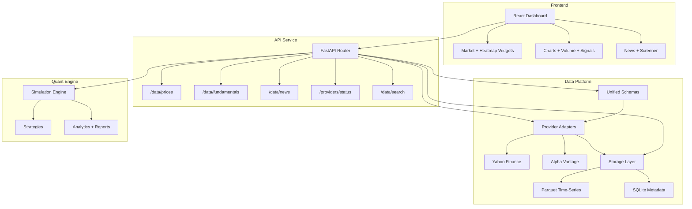

# Quant Trading Data Platform

[](https://github.com/sosahinolcay-tech/quant-trading/actions)
[](https://codecov.io/gh/sosahinolcay-tech/quant-trading)
[](https://pypi.org/project/quant-trading/)
[](https://opensource.org/licenses/MIT)

An OpenBB-style financial data platform with a FastAPI backend, unified schemas, provider adapters, and a professional React dashboard. It also retains the core quant trading engine for strategy demos and analytics.

## Features

- **Data Platform API**: `/data/prices`, `/data/fundamentals`, `/data/news`, `/providers/status`, `/data/search`
- **Unified Schemas**: normalized price + fundamentals records with provider metadata
- **Storage**: Parquet time-series + SQLite metadata
- **Providers**: Yahoo Finance, Alpha Vantage (extensible adapter pattern)
- **Frontend**: React + TypeScript dashboard with charts, heatmaps, news, and signals
- **Quant Engine**: event-driven simulation and strategy demos

## Quick Start

### Installation

1. Clone the repository:
```bash
git clone https://github.com/sosahinolcay-tech/quant-trading.git
cd quant-trading
```

2. Create virtual environment and install dependencies:
```bash
python3 -m venv .venv
source .venv/bin/activate
pip install -r requirements.txt
```

If you only want the API + frontend (without the full research stack), install the lighter API
requirements:
```bash
pip install -r api/requirements.txt
```

### Run API + Frontend

```bash
./scripts/run_api.sh
./scripts/serve_frontend.sh
```

API: `http://127.0.0.1:8010/docs`  
Frontend: `http://localhost:5173`

### Strategy Demos (optional)

```bash
python tools/run_demo.py
python tools/demo_pairs.py
```

### Streamlit Dashboard (optional)

```bash
pip install streamlit matplotlib
streamlit run app/streamlit_app.py
```

- **Performance Benchmarks**:
```bash
python tools/benchmark_report.py
```

- **Docker Compose** (optional):
```bash
docker-compose up streamlit    # Start dashboard
docker-compose up jupyter      # Start Jupyter
docker-compose up quant-trading # Run demo
```

### Run Tests

```bash
pytest
```

### Local CI Script

```bash
./scripts/ci-local.sh
```

## Project Structure

```
quant-trading/
├── qt/                          # Core framework
│   ├── engine/                  # Simulation engine
│   ├── strategies/              # Trading strategies
│   ├── risk/                    # Risk management
│   ├── analytics/               # Performance analytics
│   └── utils/                   # Utilities
├── api/                         # FastAPI service
│   └── platform_data/           # Local parquet/sqlite cache (gitignored)
├── frontend-react/              # React dashboard
├── data_platform/               # Data platform schemas, providers, storage
├── tools/                       # Demo and analysis scripts
├── tests/                       # Unit and integration tests
├── notebooks/                   # Jupyter notebooks
├── app/                         # Streamlit dashboard
└── docs/                        # Documentation
```

## Architecture



## Documentation

- **[Repository Secrets](docs/REPO_SECRETS.md)** - CI and release secret setup

## Contributing

1. Fork the repository
2. Create a feature branch
3. Add tests for new functionality
4. Ensure CI passes
5. Submit a pull request

## License

See LICENSE file for details.
