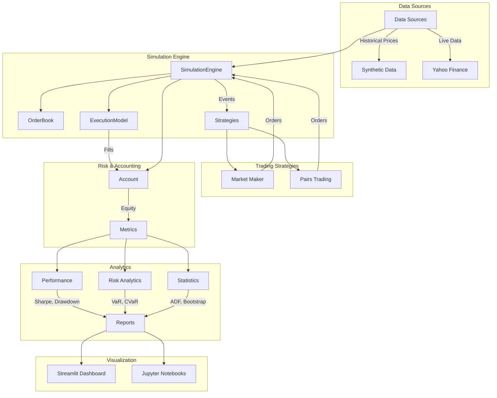

# Quant Trading Framework

[](https://github.com/sosahinolcay-tech/quant-trading/actions)
[](https://codecov.io/gh/sosahinolcay-tech/quant-trading)
[](https://pypi.org/project/quant-trading/)
[](https://opensource.org/licenses/MIT)

A comprehensive event-driven quantitative trading simulator built in Python. The framework includes multiple trading strategies, a backtesting engine, risk management, analytics, and performance evaluation tools.

## Features

- **Event-Driven Engine**: Realistic simulation with limit order matching, slippage, and transaction costs
- **Trading Strategies**:
  - Market Maker (Avellaneda model with adaptive quoting)
  - Pairs Trading (rolling OLS with z-score signals)
- **Analytics & Reporting**: Sharpe ratio, drawdown analysis, bootstrap confidence intervals, trade logs
- **Tools**: Parameter sweep optimization, walk-forward analysis, demo scripts
- **Visualization**: Interactive dashboards and Jupyter notebooks for results
- **Testing**: Comprehensive unit and integration tests
- **CI/CD**: Automated testing and deployment pipeline

## Quick Start

### Installation

1. Clone the repository:
```bash
git clone https://github.com/sosahinolcay-tech/quant-trading.git
cd quant-trading
```

2. Create virtual environment and install dependencies:
```bash
python3 -m venv .venv
source .venv/bin/activate
pip install -r requirements.txt
```

### Run Demos

- **Market Maker Demo**:
```bash
python tools/run_demo.py
```

- **Pairs Trading Demo**:
```bash
python tools/demo_pairs.py
```

- **Interactive Dashboard** (requires Streamlit):
```bash
pip install streamlit matplotlib
streamlit run app/streamlit_app.py
```

- **API + Professional Frontend**:
```bash
./scripts/run_api.sh
./scripts/serve_frontend.sh
```

- **Jupyter Notebooks**: Open `notebooks/` for interactive analysis

- **Performance Benchmarks**:
```bash
python tools/benchmark_report.py
```

- **Docker Compose** (optional):
```bash
docker-compose up streamlit    # Start dashboard
docker-compose up jupyter      # Start Jupyter
docker-compose up quant-trading # Run demo
```

### Run Tests

```bash
pytest
```

### Local CI Script

```bash
./scripts/ci-local.sh
```

## Architecture



## Project Structure

```
quant-trading/
├── qt/                          # Core framework
│   ├── engine/                  # Simulation engine
│   ├── strategies/              # Trading strategies
│   ├── risk/                    # Risk management
│   ├── analytics/               # Performance analytics
│   └── utils/                   # Utilities
├── tools/                       # Demo and analysis scripts
├── tests/                       # Unit and integration tests
├── notebooks/                   # Jupyter notebooks
├── app/                         # Streamlit dashboard
└── docs/                        # Documentation
```

## Strategies

### Market Maker
Implements the Avellaneda & Stoikov model with:
- EWMA volatility estimation
- Inventory risk management
- Adaptive bid-ask spreads

### Pairs Trading
Statistical arbitrage strategy with:
- Rolling OLS regression
- Z-score based entry/exit signals
- Cointegration testing

## Analytics

- **Performance Metrics**: Sharpe ratio, maximum drawdown, returns
- **Statistical Tests**: Augmented Dickey-Fuller for stationarity
- **Confidence Intervals**: Bootstrap resampling for Sharpe ratio
- **Walk-Forward Analysis**: Out-of-sample validation

## Documentation

- **[Final Report](docs/FINAL_REPORT.md)** - Comprehensive project report with results and analysis
- **[Final Report (HTML)](docs/FINAL_REPORT.html)** - HTML version of final report
- **[Case Study](docs/case_study.md)** - Strategy methodology and results
- **[Week 5 Risk Analytics](docs/week5_risk.md)** - Risk analytics documentation

## Contributing

1. Fork the repository
2. Create a feature branch
3. Add tests for new functionality
4. Ensure CI passes
5. Submit a pull request

## License

See LICENSE file for details.
